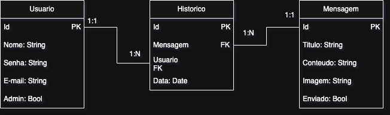

# MalaDireta v0.1.2

Sistema completo de envio e gerenciamento de mensagens em massa para usuários cadastrados.

Confira as mudanças do projeto no arquivo [CHANGELOG](CHANGELOG.md)

Desenvolvido com Node.js, React, Prisma ORM e MySQL, esse sistema permite criar mensagens com ou sem imagem, editar, deletar, enviar e manter um histórico detalhado de envios por usuário.

---



## Tecnologias Utilizadas

### Backend

- Node.js `22..16.0`
- Express `^5.1.0`
- Prisma ORM `^6.8.2`
- MySQL
- Multer`^2.0.1`
- Dotenv `^16.5.0`
- CORS `^2.8.5`
- Nodemailer `^7.0.3`
- Swagger UI `^5.24.1`
- Swagger-ui-express `^5.0.1`
- JSON Web Token (JWT) `^9.0.2`
- Bcrypt `^6.0.0`
- Nodemon (dev) `^3.1.10`

### Frontend

- React `^19.1.0`
- React DOM `^19.1.0`
- React Scripts `5.0.1`
- React Router DOM `^7.6.2`
- Axios `^1.10.0`
- React Markdown `^10.1.0`
- Marked `^10.9.2`
- React Modal
- Componentização com `MessageForm`, `MessageTable`, `EditModal`, `Header`
- Testing libraries:
  - `@testing-library/react` `^16.3.0`
  - `@testing-library/jest-dom` `^6.6.3`
  - `@testing-library/user-event` `^13.5.0`
  - `@testing-library/dom` `^10.4.0`

---

## Funcionalidades

### Mensagens

- Criar mensagens com título, conteúdo e imagem (opcional)
- Editar mensagens (somente se não enviadas)
- Excluir mensagens (somente se não enviadas)
- Enviar mensagens para lista de e-mails
- Listar todas as mensagens criadas

### Histórico

- Registro de envio por usuário
- Armazenamento no banco de dados via Prisma

### Usuários

- Cadastro e autenticação
- Identificação de administrador via middleware

### Upload de Imagens

- Imagens salvas na pasta `/uploads`
- Upload via `multer`
- Nomes únicos com base em timestamp

---

## Como Rodar o Projeto

### Backend

```bash
cd backend
npm install
npx prisma generate
npx prisma migrate dev --name init
npm start
```

### Frontend

```bash
cd frontend
npm install
npm start
```

### Banco de Dados

Antes de criar o ENV, a conta google associada deve ter a verificação de 2 fatores
e uma senha de aplicativo veja mais em: [Fazer login com senhas de app](https://support.google.com/accounts/answer/185833?hl=pt-BR)

Crie um arquivo `.env` no diretório `backend` com sua conexão:

```env
DATABASE_URL="mysql://user@localhost:3306/meubancodedados"
EMAIL_USER="seuemail@gmail.com"
EMAIL_PASS="suasenhadeaplicativo"
```

---

## Documentação da API

Acesse via Swagger:

```
http://localhost:3001/api-docs
```

---

## Problemas registrados

- Bugs visuais e de responsividade
- A imagem não aparece corretamnete no botão de Editar e Ver (Função de ver imagem REMOVIDA temporariamente)
---

## 👥 Desenvolvido por

- [João Vítor Justino Ferri](https://github.com/jvjfe)
---
